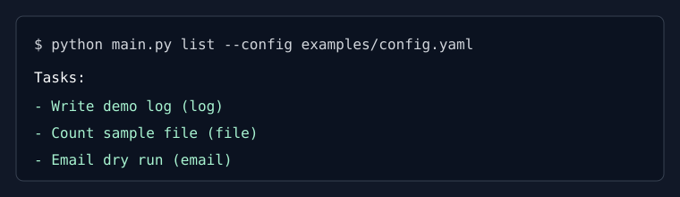
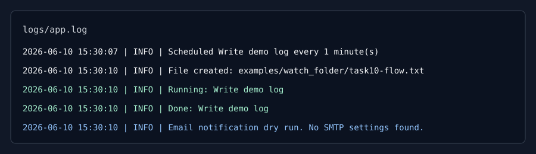

# Python Automation Tool

This is a Python Automation project. 

The app reads tasks from a JSON or YAML file. It can run tasks on a schedule and can also run tasks when files change.

## Features

- CLI commands with `argparse`
- JSON and YAML configuration loading
- Simple validation with friendly error messages
- OOP task classes using an abstract `BaseTask`
- Logging to terminal and `logs/app.log`
- Scheduled jobs using `schedule`
- Background scheduler thread using `threading`
- File monitoring using `watchdog`
- Email preparation using `smtplib` and `email.mime`
- Email notifications on task success or failure
- Safe email dry-run mode when SMTP credentials are missing
- Simple task selection using `if` / `elif`

## Project Structure

- `main.py`: starts the app and connects everything
- `cli/`: command-line arguments like start, list, stop, and status
- `config/`: reads and checks JSON/YAML config files
- `scheduler/`: runs tasks on a timer and watches files
- `tasks/`: contains the actual task classes
- `utils/`: logging setup
- `examples/`: demo config and sample files

## Installation

Create a virtual environment:

```bash
python3 -m venv .venv
source .venv/bin/activate
```

Install dependencies:

```bash
pip install -r requirements.txt
```

## Usage

Show help:

```bash
python main.py --help
python main.py start --help
python main.py stop --help
python main.py status --help
```

List configured tasks:

```bash
python main.py list --config examples/config.yaml
python main.py list --config examples/config.json
```

Start the automation tool:

```bash
python main.py start --config examples/config.yaml
```

Stop the running app:

```bash
python main.py stop
```

Run `stop` from another terminal while `start` is running. You can also press `Ctrl+C` in the start terminal.

Check status:

```bash
python main.py status
```

## YAML Config Example

```yaml
tasks:
  - task_name: Count sample file
    task_type: file
    schedule:
      type: interval
      minutes: 1
    file_path: examples/sample.txt
```

## Task Types

`log`
Writes a message to the log.

`file`
Reads a file and logs simple details such as line count and word count.

`email`
Prepares an email message. If SMTP environment variables are missing, it logs a dry-run message instead of sending.

The app also sends an email notification when a task completes or fails. If SMTP settings are missing, the notification is logged as a dry run.

## Email Environment Variables
To send real email, set these variables:

```bash
export SMTP_HOST="smtp.example.com"
export SMTP_PORT="587"
export SMTP_USER="your-user"
export SMTP_PASSWORD="your-password"
export SMTP_FROM="sender@example.com"
export SMTP_TO="receiver@example.com"
```
If these are not set, the email task still works in dry-run mode.

## Testing the Demo

Run the app:

```bash
python main.py start --config examples/config.yaml
```
Add or edit a file inside `examples/watch_folder`.

Check the log file:

```text
logs/app.log
```

Try a broken config:

```bash
python main.py list --config examples/broken_config.yaml
python main.py list --config examples/malformed_config.json
python main.py start --config examples/invalid_path_config.yaml
```

## Screenshots

CLI task list:



Log output:



## Python Topics Used

- Python basics: functions, dictionaries, lists, strings, and files
- Exception handling: friendly errors and task failure logging
- File handling: reading text files and writing logs
- OOP: task classes that inherit from `BaseTask`
- Modules and packages: code is split into folders
- `argparse`: CLI commands
- JSON/YAML: config file support
- `logging`: terminal and file logs
- `threading`: scheduler runs in the background
- `schedule`: interval and daily jobs
- `watchdog`: file monitoring
- `smtplib`: email sending support
- Git/GitHub: project is organized for meaningful commits and pushing
